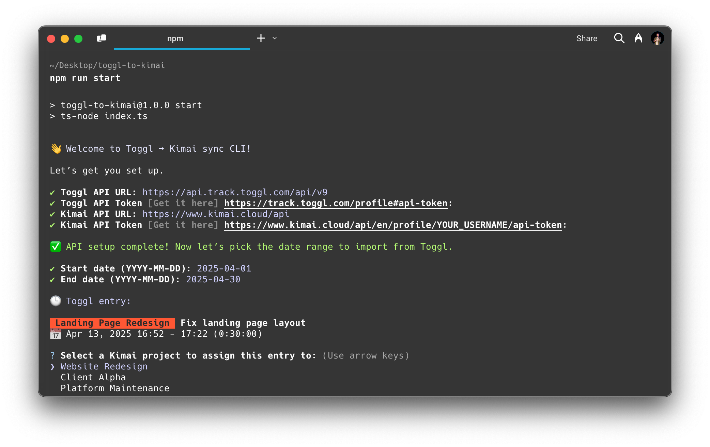

# ⏱️ Toggl → Kimai Sync CLI



A simple, interactive CLI to import time entries from **Toggl** into **Kimai**. Great for freelancers and teams who track time in Toggl but report or invoice from Kimai.

---

## 🚀 Features

- 🔐 Secure prompts for API credentials
- 📅 Pick a custom date range
- 🎨 Project and activity selection with color-coded output
- ✅ Manual confirmation before importing each entry
- 🧪 Clear success/error feedback

---

## 🧰 Requirements

- Node.js >= 16
- Toggl account & API token
- Kimai account & API token

---

## 📦 Installation

```bash
git clone https://github.com/your-username/toggl-kimai-sync.git
cd toggl-kimai-sync
npm install
```

## ▶️ Usage

```bash
npm run start
```
You’ll be prompted to:
1.	Enter your Toggl and Kimai API info
2.	Select a date range (defaults to the current month)
3.	Choose matching Kimai projects and activities
4.	Confirm and import each time entry

## 🔐 Authentication
- Toggl API Token: https://track.toggl.com/profile#api-token
- Kimai API Token: ${your-kimai-url}/en/profile/YOUR_USERNAME/api-token

API tokens are never stored or logged. They are requested at runtime and used in memory only.

## 🛠️ Development

You can run the script directly with:
```bash
ts-node src/index.ts
```
Or build and run if using TypeScript output.

## ✨ Todo / Ideas
- Cache API credentials locally (optional)
- Dry run mode
- Bulk import without confirmation
- Project/Activity mapping memory

## ‍💻 Author

Made with ☕ by [David Durco](https://x.com/durcodavid)

